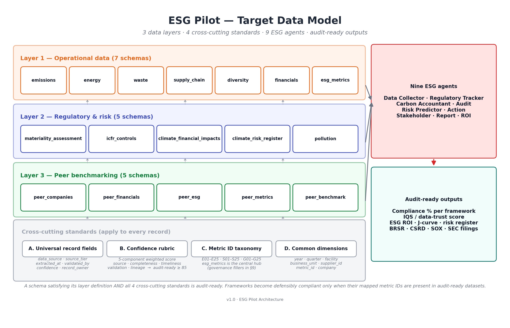
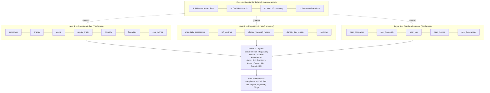
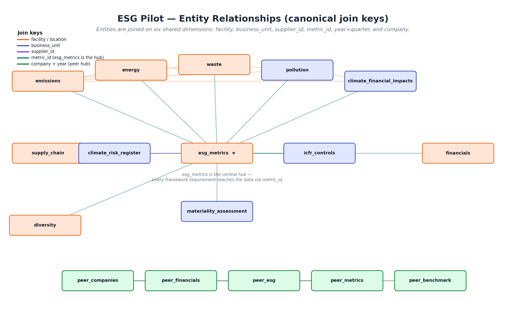
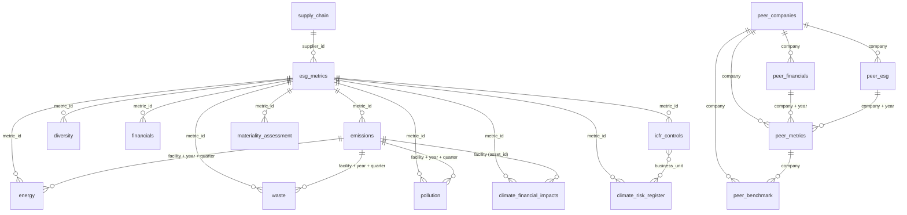
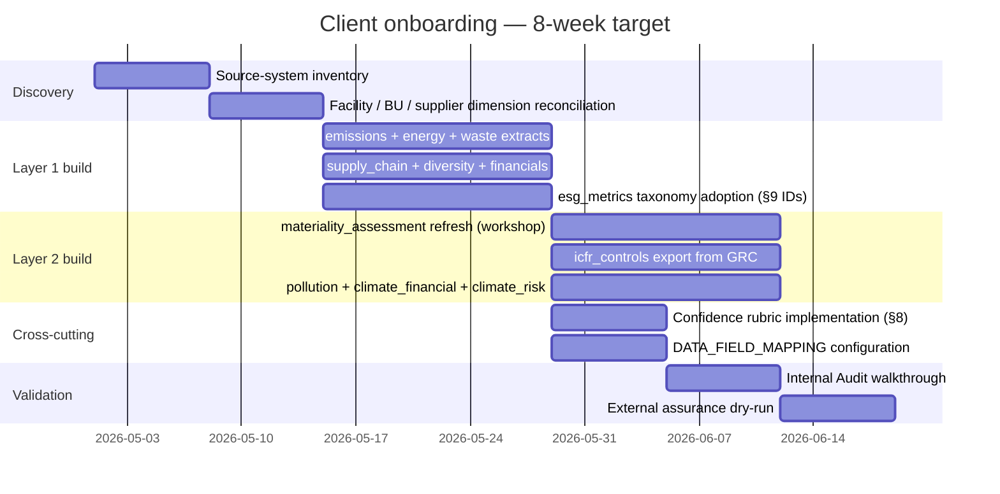

# ESG Pilot — Target Data Model

**Audience:** Client data, sustainability, and internal audit teams aligning their internal data estate with the ESG Pilot platform.

**Purpose:** Defines the canonical schemas, quality dimensions, metric taxonomy, and cross-cutting standards that every dataset must satisfy to drive the platform's nine autonomous agents — from data collection through regulatory compliance, audit readiness, and ESG ROI modelling.

> Once a client's data estate matches this model — even partially — the platform's outputs become **audit-ready** (defensible to an external assurer) rather than indicative.

---

## Table of contents

1. [Why this document](#1-why-this-document)
2. [Architecture at a glance](#2-architecture-at-a-glance)
3. [Domain catalogue](#3-domain-catalogue)
4. [Layer 1 — Operational data](#4-layer-1--operational-data)
5. [Layer 2 — Regulatory & risk](#5-layer-2--regulatory--risk)
6. [Layer 3 — Peer benchmarking](#6-layer-3--peer-benchmarking)
7. [Cross-cutting standard A — Universal record fields](#7-cross-cutting-standard-a--universal-record-fields)
8. [Cross-cutting standard B — Confidence rubric](#8-cross-cutting-standard-b--confidence-rubric)
9. [Cross-cutting standard C — Metric ID taxonomy](#9-cross-cutting-standard-c--metric-id-taxonomy)
10. [Cross-cutting standard D — Common dimensions](#10-cross-cutting-standard-d--common-dimensions)
11. [Framework coverage crosswalk](#11-framework-coverage-crosswalk)
12. [Source-system mapping](#12-source-system-mapping)
13. [Audit-readiness criteria](#13-audit-readiness-criteria)
14. [Client onboarding workflow](#14-client-onboarding-workflow)
15. [Reference sample data](#15-reference-sample-data)

---

## 1. Why this document

Most ESG platforms will accept whatever spreadsheet a client can produce. ESG Pilot is the opposite: it has an **opinionated target data model** that, once met, lets nine autonomous agents reason about the company's compliance posture, ESG-financial trade-offs, and audit readiness with no per-client configuration.

This document is the **contract between client and platform**. It is organised in three data layers and four cross-cutting standards:

- **Three data layers** — what data we need.
- **Four cross-cutting standards** — what shape every record in those layers must take so the agents and external assurers can trust it.

A dataset that satisfies its layer schema but breaks any cross-cutting standard will load but will not be marked audit-ready, and the requirements it would have answered will sit at "covered but not defensible" in the Regulatory Tracker.

---

## 2. Architecture at a glance



A higher-resolution PNG suitable for slides is in [`docs/data_model_architecture.png`](docs/data_model_architecture.png).
The entity-relationship view showing canonical join keys is in [`docs/data_model_erd.png`](docs/data_model_erd.png) and inlined as a Mermaid diagram in [§3.1](#31-entity-relationship-view).

The same architecture as a Mermaid block (renders inline on GitHub):



---

## 3. Domain catalogue

| Layer        | Schema                     | Grain                                                  | Purpose                                                | Primary frameworks served                  |
|--------------|----------------------------|--------------------------------------------------------|--------------------------------------------------------|--------------------------------------------|
| Operational  | `emissions`                | facility × scope × category × quarter                  | Scope 1/2/3 GHG inventory                              | BRSR-E1, CSRD-E1, GRI 305, GHG Protocol    |
| Operational  | `energy`                   | facility × source × quarter                            | Energy mix & renewable share                           | BRSR-E2, GRI 302, SASB                     |
| Operational  | `waste`                    | facility × stream × quarter                            | Waste, recycling, circularity                          | BRSR-P6, GRI 306, CSRD-E5                  |
| Operational  | `supply_chain`             | supplier (1 row per supplier)                          | Tier 1/2/3 ESG profile + Scope 3 hotspots              | SASB-TC-SI-550a.1, CSRD-S2, BRSR-P2        |
| Operational  | `diversity`                | year × category × subcategory × location               | Workforce DEI                                           | BRSR-P5, CSRD-S1, GRI 405                  |
| Operational  | `financials`               | year × quarter                                          | P&L + ESG-linked CapEx                                  | KPI engine, ROI agent, J-curve, SEC-XBRL   |
| Operational  | `esg_metrics`              | metric × business unit                                  | KPI taxonomy with current value, target, status         | Regulatory Tracker, Audit Agent            |
| Regulatory   | `materiality_assessment`   | topic × stakeholder × panel × horizon × cycle           | CSRD Double Materiality register                        | CSRD-DM, BRSR-S4, GRI 3                    |
| Regulatory   | `icfr_controls`            | control × test cycle                                    | SOX/ICFR controls — ESG-linked                          | SOX 302 / 404 / 906                        |
| Regulatory   | `climate_financial_impacts`| event (period × asset × scenario)                       | SEC SX-14 climate-tagged GL events                      | SEC-CLIM SX-14/1502, IFRS S2               |
| Regulatory   | `climate_risk_register`    | risk × scenario × horizon × BU                          | TCFD / IFRS S2 ERM register                             | TCFD, IFRS S2, CSRD-E1                     |
| Regulatory   | `pollution`                | facility × medium × pollutant × quarter                 | Air / water / land pollutants vs. permit                | CSRD-E3, BRSR-P6, CPCB / state-PCB         |
| Peer         | `peer_companies`           | company (1 row each)                                    | Master list with sector & ticker                        | Benchmarking input                         |
| Peer         | `peer_financials`          | company × year                                          | Full P&L + balance sheet                                | ESG-financial correlation                  |
| Peer         | `peer_esg`                 | company × year                                          | Emissions, ESG capex, sub-scores, controversies         | Sector ESG trajectory                      |
| Peer         | `peer_metrics`             | company × year                                          | Calculated ratios (derived)                             | Peer ranking, heatmaps                     |
| Peer         | `peer_benchmark`           | company (1 row each)                                    | 5-yr averages                                           | Dashboard tiles                            |

---

### 3.1 Entity-relationship view

How the 17 schemas join via the canonical dimensions defined in [§10](#10-cross-cutting-standard-d--common-dimensions). `esg_metrics` is the central hub — every framework requirement reaches operational data via `metric_id`. Operational and Layer-2 schemas share `facility`, `business_unit`, `supplier_id`, and `year + quarter`. Peer schemas form a separate cluster keyed on `company + year`.



The same view as a Mermaid `erDiagram` (GitHub-rendered, click to expand):



**Reading the picture:**

- **Orange lines** — `facility` joins. `emissions`, `energy`, `waste`, `pollution`, and `climate_financial_impacts` (`affected_asset_id`) all share the same canonical facility name.
- **Indigo lines** — `business_unit` joins. `esg_metrics`, `icfr_controls`, and `climate_risk_register` join here.
- **Purple line** — `supplier_id`, only between `supply_chain` and Scope-3-aware metrics in `esg_metrics`.
- **Teal lines** — `metric_id` rays from `esg_metrics`. This is the join the Regulatory Tracker traverses when checking framework coverage.
- **Green lines** — `company + year` joins inside the peer cluster. The peer panel is a separate "world" and joins to the single-company side only via the subject company name appearing in both.

---

## 4. Layer 1 — Operational data

The seven schemas every client must deliver to put the platform into audit-ready mode.

### 4.1 `emissions`
**Grain:** `(year, quarter, facility, scope, category, subcategory)`
**Required:** `year, quarter, scope, category, emissions_tco2e`
**Recommended:** `subcategory, facility, methodology` (GHG Protocol / IPCC tier), `verified_by` (assurance provider), `source` (the bill / log / IoT meter), `confidence`
**Source systems (typical):** ERP fuel & utility ledgers · DCS/SCADA historians · 3PL freight portals · Travel system extracts · Supplier EEIO databases
**Volume sanity check:** A 30-facility petrochemical company produces ~10,000 quarterly rows over 7 years.

### 4.2 `energy`
**Grain:** `(year, quarter, facility, energy_source)`
**Required:** `year, quarter, energy_source, consumption_mwh`
**Recommended:** `cost_inr_lakhs, location, renewable, contract_id, supplier, peak_demand_kw, load_factor_pct, meter_id, tariff_inr_per_kwh`
**Source systems:** DISCOM utility billing · PPA contract registers · BMS meters · On-site solar/wind controllers
**Why both `renewable` (Yes/No) and `energy_source`:** the renewable flag drives KPI E03 directly; `energy_source` enables fuel-mix analysis and is required for SASB.

### 4.3 `waste`
**Grain:** `(year, quarter, facility, waste_type, category)`
**Required:** `year, quarter, waste_type, category, quantity_mt`
**Recommended:** `disposal_method, recycled_pct, location, contractor, manifest_id, cost_inr_lakhs`
**Source systems:** EHS systems (Enablon, Cority, Sphera) · Authorised TSDF receipts · Internal weighbridge logs

### 4.4 `supply_chain`
**Grain:** `supplier_id` (one row per supplier per active period)
**Required:** `supplier_id, supplier_name, country`
**Recommended:** `sector, tier, esg_score, risk_rating, emission_contribution_tco2e, audit_status, last_audit_date, key_risk_factors, annual_spend_inr_crores, scope3_category` (GHG Protocol Cat 1–15), `single_source_flag, emission_factor_source`
**Source systems:** Procurement (SAP Ariba, Oracle, Coupa) · Supplier ESG portals (EcoVadis, CDP Supply Chain, Sedex) · Bill-of-materials systems
**Why `scope3_category` is critical:** without it, Scope 3 emissions remain rolled-up and the platform cannot identify the top-3 hotspot categories that BRSR Core and CSRD-E1 require.

### 4.5 `diversity`
**Grain:** `(year, category, subcategory, metric, location)`
**Required:** `year, category, subcategory, metric, value`
**Recommended:** `unit, location, source` (HRIS / voluntary self-id survey / pay review)
**Source systems:** HRIS (Workday, SuccessFactors, SAP HR, Darwinbox) · Pay equity reviews · DE&I self-id surveys
**Note on sensitive data:** voluntary self-disclosure for LGBTQ+, disability, veteran status — must respect local privacy law (GDPR, DPDP).

### 4.6 `financials`
**Grain:** `(year, quarter)` — single-company P&L
**Required:** `year, quarter, revenue_inr_crores`
**Recommended:** `ebitda_inr_crores, ebitda_margin_pct, pat_inr_crores, roa_pct, roe_pct, debt_equity_ratio, cost_of_capital_pct, pe_ratio, carbon_tax_exposure_lakhs, energy_cost_inr_crores, employee_turnover_pct, brand_value_index, talent_retention_score, esg_linked_capex_inr_crores`
**Source systems:** Group consolidation (Hyperion, OneStream, SAP S/4HANA) · Treasury · IR brand-tracking
**Why the schema cardinality is fixed:** the table powers ROI / J-curve modelling at the group level. Per-segment financials live separately.

### 4.7 `esg_metrics`
**Grain:** `(metric_id, business_unit)`
**Required:** `metric_id, pillar, category, metric_name`
**Recommended:** `unit, value_2023, value_2024, target_2024, status, data_source, confidence, business_unit, framework_tags`
**This is the central hub** that the Regulatory Tracker queries to decide whether each framework requirement is covered. Every metric ID a framework references must exist here. See [§9 Metric ID taxonomy](#9-cross-cutting-standard-c--metric-id-taxonomy).

---

## 5. Layer 2 — Regulatory & risk

These five schemas turn raw operational data into a defensible regulatory filing. Without them, frameworks like CSRD-DM, SOX-404, and SEC-CLIM are mathematically impossible to cover regardless of how good the operational data is.

### 5.1 `materiality_assessment`
**Closes:** CSRD Double Materiality, BRSR-S4 stakeholder engagement, GRI 3 material topics.
**Grain:** `(topic_id, stakeholder_group, time_horizon, assessment_date, panel)`
**Required:** `topic_id, topic_name, impact_materiality_score (0-10), financial_materiality_score (0-10), stakeholder_group, time_horizon, assessment_date`
**Recommended:** `esg_pillar, evidence_link, owner, decision (Material / Watch / Not Material), framework_alignment, assessment_panel`
**Source systems:** Sustainability team's materiality workshop register · Investor / NGO consultation logs · Board materiality refresh decks
**Cadence:** at minimum biannual refresh; CSRD requires evidence of stakeholder consultation.

### 5.2 `icfr_controls`
**Closes:** SOX 302 (CEO/CFO certification), SOX 404 (ICFR coverage), SOX 906 (criminal certification).
**Grain:** `(control_id, test_date)` — controls register joined to test events
**Required:** `control_id, process, control_owner, test_date`
**Recommended:** `esg_metric_linked` (FK → `esg_metrics.metric_id`), `deficiency_flag` (None / Deficiency / Significant / Material), `remediation_status, sox_section, control_type, frequency, tester, evidence_doc_id, control_objective, business_unit, grc_tool`
**Source systems:** GRC platforms (AuditBoard, Workiva, ServiceNow GRC, MetricStream) · Internal Audit working papers · CEO/CFO sub-certification letters
**Why `esg_metric_linked` matters:** it's the bridge between operational data and ICFR — the field that tells an external assurer "this Scope 1 figure was reviewed under control ICFR-ESG-00042."

### 5.3 `climate_financial_impacts`
**Closes:** SEC Climate Disclosure SX-14, Item 1502, Item 1506; IFRS S2 financial-impact paragraphs; CSRD-E1 transition plan financials.
**Grain:** event-level `(fiscal_period, affected_asset_id, event_type, scenario_tag)`
**Required:** `fiscal_period, event_type` (Acute / Chronic / Transition), `capex_climate, opex_climate`
**Recommended:** `impairment_amount, insurance_recovery, affected_asset_id, gl_account, scenario_tag` (NGFS/IEA/RCP), `description, approver, supporting_doc, narrative, currency`
**Source systems:** Group close (SAP S/4HANA, Oracle Cloud ERP, Hyperion) · Treasury insurance ledger · ERM scenario-analysis platform
**Cadence:** posted with every monthly/quarterly close; tagged at journal-entry level.

### 5.4 `climate_risk_register`
**Closes:** TCFD, IFRS S2, CSRD-E1 transition risk, COSO ERM climate add-on.
**Grain:** `(risk_id, scenario, time_horizon, affected_business_unit)`
**Required:** `risk_id, category` (Physical-Acute / Physical-Chronic / Transition-Policy / Transition-Tech / Transition-Market), `scenario, time_horizon, likelihood, financial_impact_inr_crores`
**Recommended:** `mitigation, status, owner, affected_business_unit, risk_description`
**Source systems:** ERM register (Archer, MetricStream, ServiceNow GRC) · Climate-scenario consulting outputs (NGFS, IEA, RCP) · Strategy & Planning long-range plan

### 5.5 `pollution`
**Closes:** CSRD-E3 Pollution Prevention, BRSR-P6 air/water/land emissions, CPCB / state-PCB compliance.
**Grain:** `(year, quarter, facility, emission_medium, pollutant_type)`
**Required:** `year, quarter, emission_medium` (Air / Water / Land), `pollutant_type, quantity_kg`
**Recommended:** `location, regulatory_limit_kg, monitoring_method, discharge_point, exceedance_flag, permit_id, regulator, lab_accreditation, test_report_id`
**Source systems:** CEMS continuous monitors · Auto-samplers · NABL/ISO-17025 lab reports · Pollution control board permits

---

## 6. Layer 3 — Peer benchmarking

Optional but high-impact. These five schemas drive sector comparison, ESG-financial correlation, and the J-curve sector overlay. They are typically sourced from a third-party data vendor (CMIE, S&P Capital IQ, Refinitiv, Bloomberg) plus the client's broker research subscriptions.

| Schema             | Grain                                  | Purpose                                                                      |
|--------------------|----------------------------------------|------------------------------------------------------------------------------|
| `peer_companies`   | company (1 row each)                   | Master list with sector, ticker, fiscal year-end, currency                   |
| `peer_financials`  | company × year                          | Full P&L + balance sheet items                                                |
| `peer_esg`         | company × year                          | Emissions, ESG capex, ESG score (composite + E/S/G sub-scores), controversies |
| `peer_metrics`     | company × year                          | Calculated ratios (derived from the above two)                                |
| `peer_benchmark`   | company (1 row each)                   | 5-yr averages for at-a-glance dashboard tiles                                 |

The peer panel must include the **subject company itself** so single-company outputs can be cross-referenced against the peer view (this is what the platform's `Helix Industries Ltd` reference dataset does).

---

## 7. Cross-cutting standard A — Universal record fields

Every record in every schema should carry these lineage and audit fields, even when the schema doesn't explicitly require them. The platform reads them; auditors require them.

| Field                  | Type       | Purpose                                                         |
|------------------------|------------|-----------------------------------------------------------------|
| `data_source`          | str        | Specific system/file the row was extracted from                 |
| `source_system`        | str        | The system class (`ERP`, `EHS`, `HRIS`, `GRC`, `Manual`)        |
| `source_tier`          | enum 1–4   | Source-tier classification — see §8.1                            |
| `extracted_at`         | timestamp  | Wall-clock time the row landed in ESG Pilot                      |
| `last_validated_at`    | timestamp  | Last time validation rules ran clean against the row             |
| `validated_by`         | str        | User or service account that ran validation                      |
| `confidence`           | float 0–1  | Per-record confidence score — see §8                             |
| `restated_flag`        | bool       | True if the row replaces a prior period restatement              |
| `record_owner`         | str        | Functional owner (e.g. `EHS — Hazira`)                           |

> **Implementation note:** these fields don't all have to be in every CSV. The minimum is `data_source` + `confidence`. The rest can be carried in a side-table keyed by record hash if the source system doesn't natively provide them.

---

## 8. Cross-cutting standard B — Confidence rubric

`confidence` is a **data-trust score**, not a statistical confidence interval. It must be defensible to an external assurer.

### 8.1 The five components

| Component             | Weight | What is measured                                                                                                       | DE-owned? |
|-----------------------|-------:|------------------------------------------------------------------------------------------------------------------------|-----------|
| Source reliability    | 25%    | Tier 1 (metered/IoT/ERP) = 100 · Tier 2 (invoiced/billed) = 80 · Tier 3 (supplier-reported) = 60 · Tier 4 (estimated) = 40 | Co-owned with Audit (tier mapping is locked in writing) |
| Completeness          | 20%    | % non-null across required fields for the row                                                                          | Yes       |
| Timeliness / freshness| 15%    | Days since last refresh vs. expected cadence (Q-end + 30d expected; older decays linearly)                             | Yes       |
| Validation pass rate  | 20%    | % of schema + business-rule checks passed (units, ranges, FK integrity)                                                | Yes (rules co-designed with ESG) |
| Lineage & auditability| 20%    | Has `data_source` + `extracted_at` + `validated_by` + transformation log? Each present scores 25 points                  | Yes       |

### 8.2 Aggregation

- **Per record:** weighted mean of the five component scores → `confidence` (0–1).
- **Per dataset (`avg_confidence`):** mean of `confidence` across all records, expressed 0–100.
- **Materiality-weighted variant:** for KPIs with revenue/asset weights, weight by row materiality.

### 8.3 Audit-ready threshold

| `avg_confidence` | Tier        | Implication for compliance % |
|------------------|-------------|------------------------------|
| ≥ 85             | Audit-ready | Counts toward defensible compliance % |
| 70 – 84          | Review      | Counts toward indicative compliance %; assurance needs remediation |
| < 70             | Remediate   | Excluded from compliance % until fixed |

### 8.4 Worked example — `emissions` at 87.3

```
Source reliability    90  (mix of IoT meters + invoiced energy)
Completeness         100  (all required fields populated)
Timeliness            85  (a few monthly lags)
Validation            80  (a handful of unit/range flags)
Lineage               80  (good provenance, not every row carries the full transformation log)

Weighted = 90·0.25 + 100·0.20 + 85·0.15 + 80·0.20 + 80·0.20
         = 22.5 + 20 + 12.75 + 16 + 16
         = 87.25 → reported 87.3
```

This is the level of decomposition an external assurer can follow.

### 8.5 Roles & responsibilities

| Role                | Owns                                                                              |
|---------------------|------------------------------------------------------------------------------------|
| Data Engineering    | The `compute_confidence(record)` function and per-component calculators            |
| ESG / Sustainability| Source-tier mapping, validation rules, materiality weights                         |
| Internal Audit      | Sign-off that the rubric meets ICFR-over-ESG standards (post-SOX-404 build)        |

---

## 9. Cross-cutting standard C — Metric ID taxonomy

Every framework requirement is checked against `esg_metrics.metric_id`. The platform reserves the following ranges. **Both client and platform must agree on the IDs before mapping begins** — this is the single biggest cause of "0% compliance even though I have the data" outcomes.

### 9.1 Environmental — `E01`–`E25`

| ID  | Metric                            | Frameworks                          |
|-----|-----------------------------------|-------------------------------------|
| E01 | Total GHG Emissions (Scope 1+2)   | BRSR-E1, CSRD-E1, GRI 305           |
| E02 | Scope 3 Emissions                 | BRSR-E1, CSRD-E1, GHG Protocol      |
| E03 | Renewable Energy Share            | BRSR-E2, GRI 302                    |
| E04 | Total Water Withdrawal            | CDP-Water, GRI 303                  |
| E05 | Water Recycled & Reused           | CSRD-E3, BRSR-P6                    |
| E06 | Total Waste Generated             | GRI 306, BRSR-P6                    |
| E07 | Waste Diverted from Landfill      | CSRD-E5, GRI 306                    |
| E08 | Hazardous Waste                   | BRSR-P6                             |
| E09 | Land Use / Biodiversity           | TNFD, CSRD-E4                       |
| E10 | Total Energy Consumption          | BRSR-E2, GRI 302                    |
| E11 | Air Pollutants (NOx/SOx/PM)       | CSRD-E3, BRSR-P6                    |
| E12 | Water Pollutants (BOD/COD/TSS)    | CSRD-E3, BRSR-P6                    |
| E13 | Hazardous Substance Releases      | CSRD-E3                             |
| E14 | Climate-related CapEx             | SEC-CLIM, IFRS S2                   |
| E15 | Climate-related OpEx              | SEC-CLIM, IFRS S2                   |
| E16 | Stranded-Asset Impairment         | IFRS S2, SEC-CLIM SX-14             |
| E17 | Insurance Recovery — Climate      | SEC-CLIM SX-14                      |
| E18 | Carbon Tax Exposure               | BRSR-E1, IFRS S2                    |
| E19 | Sustainable Sourcing Share        | BRSR-P2, CSRD-DM                    |
| E20 | Green-Asset Intensity             | EU Taxonomy                         |

### 9.2 Social — `S01`–`S25`

| ID  | Metric                            | Frameworks                          |
|-----|-----------------------------------|-------------------------------------|
| S01 | Total Employees                   | BRSR-P3, CSRD-S1, GRI 2-7           |
| S02 | Voluntary Turnover                | BRSR-P3, GRI 401                    |
| S03 | Female Representation Overall     | BRSR-P5, CSRD-S1, GRI 405           |
| S04 | Female Representation Leadership  | BRSR-P5, CSRD-S1                    |
| S05 | Pay Ratio Gender                  | BRSR-P5, GRI 405                    |
| S06 | LTIFR                             | BRSR-P3, GRI 403                    |
| S07 | Safety Training Hours / Employee  | BRSR-P3, GRI 403                    |
| S08 | CSR Spend                         | BRSR-P8, GRI 413                    |
| S09 | Community Beneficiaries           | BRSR-P8                             |
| S10 | Average Training Hours / Employee | BRSR-P5, GRI 404                    |
| S11 | Differently-Abled Representation  | BRSR-P5                             |
| S12 | Suppliers Audited on ESG          | BRSR-P2, SASB-TC-SI-550, CSRD-S2   |
| S13 | Local Sourcing Share              | BRSR-P8                             |
| S14 | Human Rights Salience Assessment  | UN-Guiding, BRSR-P5, CSRD-S2        |
| S15 | Consumer Complaints Resolved      | BRSR-P9, CSRD-S4                    |
| S16 | Product Safety Incidents          | BRSR-P9, ISO-9001                   |
| S17 | Indigenous Rights — FPIC          | UN-Guiding, IFC PS 7                |
| S18 | Just Transition Programme         | CSRD-S1, ILO                        |
| S19 | Workforce Engagement Score        | CSRD-S1, GRI 404                    |
| S20 | Living Wage Compliance            | UN-Guiding, BRSR-P5                 |

### 9.3 Governance — `G01`–`G25`

| ID  | Metric                                  | Frameworks                          |
|-----|-----------------------------------------|-------------------------------------|
| G01 | Board Size                              | BRSR-P1, ICGN                       |
| G02 | Independent / Female Board Share        | BRSR-P1, ICGN, CSRD-G1              |
| G03 | Board ESG Oversight Frequency           | TCFD-Gov, IFRS S2                   |
| G04 | Anti-Corruption Training Coverage       | BRSR-P1, GRI 205                    |
| G05 | Whistleblower Cases Raised / Substantiated | BRSR-P1, GRI 205                |
| G06 | **ICFR Assessment Coverage**            | **SOX 404, COSO ERM**               |
| G07 | Data Privacy Complaints / Breaches      | GDPR, DPDP, CSRD-G1                 |
| G08 | **CEO/CFO Sub-Certification**           | **SOX 302, SOX 906**                |
| G09 | **Climate Governance Structure**        | **SEC-CLIM 1501, TCFD-Gov, IFRS S2**|
| G10 | **Board Climate Strategy Disclosure**   | **SEC-CLIM 1502, TCFD-Strat**       |
| G11 | **Climate Risk Process Integration**    | **TCFD-RM, IFRS S2**                |
| G12 | **Materiality Assessment Cycle**        | **CSRD-DM, BRSR-S4, GRI 3**         |
| G13 | **Stakeholder Engagement Coverage**     | **BRSR-S4, CSRD-DM**                |
| G14 | **External ESG Assurance Level**        | **CSRD-Assurance, IFRS S1**         |
| G15 | Effective Tax Rate                      | GRI 207, BRSR-P1                    |
| G16 | Lobbying & Public Policy Spend          | GRI 415                             |
| G17 | Bribery & Corruption Incidents          | BRSR-P1, GRI 205                    |
| G18 | Cybersecurity Incidents (Material)      | SEC, NIST-CSF, ISO 27001            |
| G19 | Disclosure Controls & Procedures        | SOX 302, SEC                        |
| G20 | Document Retention Programme            | SOX 802                             |

> **IDs in bold are the gap fillers** that the Audit Agent and Regulatory Tracker need today. Without them, SOX-404, SEC-CLIM, and CSRD-DM cannot be reported as covered no matter how rich the operational data is.

### 9.4 How metric IDs feed compliance

```
framework requirement → declares data_field(s) → DATA_FIELD_MAPPING → metric_id(s) → esg_metrics.metric_id present?
                                                       ↑                                    ↓
                                              configured by analyst              populated by client + DE
                                                                                                ↓
                                                                         confidence ≥ 85? → audit-ready compliance
```

Both halves of this chain — the mapping config and the populated metric — must be in place. See [§4.7](#47-esg_metrics) and [§11 Framework crosswalk](#11-framework-coverage-crosswalk).

---

## 10. Cross-cutting standard D — Common dimensions

The platform joins datasets on a small number of canonical dimensions. Naming consistency here is non-negotiable.

| Dimension       | Canonical column name(s)                          | Used in                                                                                    |
|-----------------|---------------------------------------------------|---------------------------------------------------------------------------------------------|
| **Time**        | `year` (int), `quarter` ("Q1"–"Q4"), `fiscal_period` ("FY2024-Q3") | All operational schemas; `climate_financial_impacts`                                |
| **Facility**    | `location` or `facility` (free-text canonical name) — must match across `emissions`, `energy`, `waste`, `pollution`, `climate_financial_impacts.affected_asset_id` | All EHS-relevant schemas             |
| **Business unit / function** | `business_unit` (canonical short code, e.g. `PCH-JMG`) | `esg_metrics`, `icfr_controls`, `climate_risk_register`                                     |
| **Supplier**    | `supplier_id` (FK from `supply_chain` to anywhere referencing suppliers) | `supply_chain`; future Scope-3 line items                                                     |
| **Metric**      | `metric_id` (E/S/G NN per §9)                     | `esg_metrics`; the join target for `regulatory_frameworks → DATA_FIELD_MAPPING`             |
| **Company**     | `company` (must match across all `peer_*` schemas) | All peer schemas                                                                            |
| **Currency**    | `INR Crore` for monetary values unless explicitly noted (`INR Lakhs` is acceptable for `pollution.cost_inr_lakhs`-style tables) | All monetary fields                          |

> The platform's column-mapper accepts synonyms (e.g. `Revenue` → `revenue_inr_crores`), but **dimension values must match exactly** across schemas — `Hazira Refinery` ≠ `Hazira Plant` ≠ `Hazira` for join purposes.

---

## 11. Framework coverage crosswalk

Schema → framework requirement coverage. Assumes the metric IDs in §9 are populated and `DATA_FIELD_MAPPING` is configured.

| Framework | Total reqs | Covered by Layer-1 alone | Adds with Layer-2 | Aspirational coverage |
|-----------|-----------:|--------------------------|-------------------|-----------------------|
| BRSR (SEBI India)        | 27 | 22 | +3 (P5 stakeholder, P6 pollution, P1 governance) | 25 / 27 |
| CSRD (EU ESRS)           | 22 |  9 | +10 (DM, E3, E1 fin, S2 supply, G1 governance) | 19 / 22 |
| SOX (US Public-Co)       |  5 |  0 | +5 (controls register, certifications)          |  5 / 5  |
| SEC Climate Disclosure   |  8 |  1 | +6 (climate-financial, governance, risk)        |  7 / 8  |
| GRI Universal & Topic    | 18 | 16 | +1 (3 — material topics)                        | 17 / 18 |
| SASB (Industry-specific) | 10 |  6 | +2 (550a.1 supplier dependency, RT-CH air)      |  8 / 10 |

**Gap that no schema closes** — these need a second source-of-truth platform integration (typically GRC + regulatory consultant working papers):
- BRSR Core BRSR-Asn (limited assurance)
- SOX Auditor Letter (KPMG/Deloitte/PwC sign-off)
- CSRD Assurance Statement (limited → reasonable)
- SEC Form 10-K linkage

---

## 12. Source-system mapping

Where each schema typically lives in a Fortune-500 / Indian-PSU client estate. Useful for the Procurement / IT / Data-Eng kickoff conversation.

| Schema                     | Primary source                              | Secondary / supporting                              |
|----------------------------|---------------------------------------------|------------------------------------------------------|
| `emissions`                | ERP (SAP S/4HANA, Oracle Cloud ERP)         | DCS/SCADA, IoT meters, 3PL portals                   |
| `energy`                   | DISCOM utility billing, BMS                 | PPA registers, on-site solar/wind controllers        |
| `waste`                    | EHS (Enablon, Cority, Sphera)               | Authorised TSDF receipts                             |
| `supply_chain`             | Procurement (Ariba, Coupa, Oracle)          | EcoVadis, CDP Supply Chain, Sedex                    |
| `diversity`                | HRIS (Workday, SuccessFactors, SAP HR, Darwinbox) | Pay-equity reviews, voluntary self-id surveys |
| `financials`               | Group consolidation (Hyperion, OneStream, S/4HANA) | Treasury, IR brand-tracking                  |
| `esg_metrics`              | Sustainability data warehouse / BI mart    | Custom-built mart curated by ESG team                |
| `materiality_assessment`   | Sustainability team workshop register      | Investor / NGO consultation logs                     |
| `icfr_controls`            | GRC (AuditBoard, Workiva, ServiceNow GRC)   | Internal Audit working papers                        |
| `climate_financial_impacts`| Group close + climate-tagging GL flag       | ERM scenario platform (Riskonnect, Archer)           |
| `climate_risk_register`    | ERM register                                | Climate-scenario consulting outputs                  |
| `pollution`                | CEMS, NABL/ISO-17025 lab reports            | State PCB permits                                    |
| `peer_*`                   | Third-party data vendor                     | Broker research, internal analyst spreadsheets       |

---

## 13. Audit-readiness criteria

A dataset is **audit-ready** when **all** five conditions are true:

1. **Schema conformance** — every required column present, type-clean, value enumerations respected.
2. **Cardinality complete** — no missing periods/facilities/categories (e.g. all 30 facilities × 4 quarters present for `emissions`).
3. **Cross-schema consistency** — facility names, business unit codes, supplier IDs match across schemas. (Validated by the platform's `validate_mapped_data` plus reconciliation reports.)
4. **`avg_confidence` ≥ 85** — see [§8.3](#83-audit-ready-threshold).
5. **Lineage coverage 100%** — every record carries `data_source` + `extracted_at` + `validated_by`.

A framework requirement is **defensibly compliant** when its mapped metric IDs are present **and** every dataset feeding those metric IDs is audit-ready.

---

## 14. Client onboarding workflow

The recommended sequence to move from "data scattered across systems" to "audit-ready compliance %." Eight-week target for a mid-size client.



**Quick-win sequence (week 1–2):** load the seven Layer-1 schemas as-is. Compliance will move to ~30–40% on BRSR/GRI even without Layer 2 or the confidence rubric. This wins early board confidence.

**Stretch sequence (week 3–6):** add Layer 2. SOX/SEC/CSRD-DM begin to register coverage. This is when the platform's audit-trail becomes a regulator-defensible artefact.

**Lock-in sequence (week 7–8):** confidence rubric + lineage backfill + Internal Audit sign-off. Compliance % is now reportable to the audit committee.

---

## 15. Reference sample data

A complete reference dataset matching this model — internally consistent across all 17 schemas — ships with the platform under [`sample_data/`](sample_data/). It models the fictional **Helix Industries Ltd** (PetroChemical, India) and is suitable for client demos and acceptance testing.

| Layer        | Files            | Records        | Total size |
|--------------|------------------|----------------|-----------:|
| Operational  | 7 CSV files      | ~64,000 rows   | ~9.3 MB    |
| Regulatory   | 5 CSV files      | ~52,000 rows   | ~10.2 MB   |
| Peer         | 5 CSV files      | ~22,000 rows   | ~3.8 MB    |

Re-generate with:

```bash
python3 scripts/generate_sample_datasets.py
```

The generator is deterministic — every run produces byte-identical output, so the sample data can be checked into a client's acceptance environment as a fixed reference.

---

## 16. Code changes required to deliver this model

This is the implementation gap between the **current platform** and the **target data model** above. Each change is sized; none requires architectural change.

### 16.1 `agents/regulatory_tracker.py` — extend `DATA_FIELD_MAPPING`

**Current state:** 43 of 88 framework `data_fields` are mapped; the remaining 45 fall into the "No data mapping available" bucket and report 0% coverage regardless of source data quality.

**Change:** add ~45 entries pointing each unmapped framework `data_field` at one or more metric IDs from §9. The 9 governance metric IDs in §9.3 (G06, G08–G14) are net-new; the rest extend the existing E/S series.

**Files touched:** `agents/regulatory_tracker.py` (DATA_FIELD_MAPPING dict).
**Effort:** ~2 hours · pure config.
**Impact:** BRSR / CSRD / SOX / SEC compliance % moves from 0% → 30–80% range immediately.

### 16.2 `scripts/generate_sample_datasets.py` — emit new metric IDs

**Current state:** `esg_metrics` generator emits 56 metrics (E01–E23, S24–S41, G42–G55-ish — the original taxonomy). The 9 governance fillers (G06, G08–G14) and ~6 environmental fillers (E11–E17) are absent, so even after §16.1 the requirements they map to will be "Required data not found in available metrics".

**Change:** extend `ESG_METRIC_TAXONOMY` in the generator to emit rows for the new metric IDs in §9. Re-run the generator. Verify each new metric ID appears in `esg_metrics.csv`.

**Files touched:** `scripts/generate_sample_datasets.py`.
**Effort:** ~3 hours.
**Impact:** completes the chain — framework requirements now resolve to populated metric IDs.

### 16.3 Add `confidence` column to the 5 new schemas

**Current state:** `compute_data_quality()` sets `avg_confidence = df["confidence"].mean() * 100` ([utils/data_processing.py:83-86](utils/data_processing.py#L83-L86)). Only `emissions` and `esg_metrics` carry a `confidence` column; the other 15 schemas (and the 5 new regulatory schemas, the supply_chain extension) do not. Result: `avg_confidence = 0` → datasets stuck at "Medium" confidence and excluded from audit-ready compliance %.

**Change:** add a `confidence` column (float 0–1) to the generators for `materiality_assessment`, `icfr_controls`, `climate_financial_impacts`, `climate_risk_register`, `pollution`, `supply_chain` (and ideally `energy`, `waste`, `diversity`, `financials` for completeness). Initial values can be plausible defaults (0.78–0.95 random) until the real 5-component rubric (§8) is implemented.

**Files touched:** `scripts/generate_sample_datasets.py`.
**Effort:** ~1 hour.
**Impact:** audit-ready dataset count moves from 2/20 to most-of-20.

### 16.4 Implement the 5-component confidence rubric

**Current state:** confidence is a single per-record float that the dataset author writes manually. There is no decomposition, no source-tier mapping, no validation-pass-rate calculation, no lineage check.

**Change:** implement a `compute_confidence(record, dataset_meta)` function in `utils/data_processing.py` that scores each of the 5 components in §8.1 and returns a weighted score. The Data Collector calls it for each ingested row and writes the result back to `confidence`.

**Files touched:** `utils/data_processing.py` (new function), `agents/data_collector.py` (calls it during ingest), `core/company_config.py` (rubric weights + tier mapping config).
**Effort:** ~2 days (the calculator is small, but the source-tier mapping and validation rules need ESG/Audit sign-off before they're locked in).
**Impact:** confidence scores become defensible to an external assurer instead of being authored values.

### 16.5 Universal record fields — schema additions

**Current state:** schemas don't formally include `data_source`, `source_tier`, `extracted_at`, `validated_by`, `record_owner`. A few schemas have ad-hoc equivalents (`source` on `emissions`, `data_source` on `esg_metrics`).

**Change:** add the 5 universal record fields to every schema in `utils/schema_mapper.py` as optional columns with synonym entries. The Data Collector populates them automatically on ingest where the source system provides them; otherwise they default to platform-generated values (`extracted_at = now()`, etc.).

**Files touched:** `utils/schema_mapper.py` (add fields to all schemas), `agents/data_collector.py` (populate defaults during ingest).
**Effort:** ~1 day.
**Impact:** lineage column of the confidence rubric (§8.1 row 5) becomes computable from data instead of a manual audit.

### 16.6 Regulatory frameworks JSON — new requirements

**Current state:** [`data/regulatory_frameworks.json`](data/regulatory_frameworks.json) defines 60+ requirements across 6 frameworks. None reference the Layer-2 schemas (materiality, ICFR, climate-financial, climate-risk, pollution).

**Change:** add ~10 new requirements per framework that explicitly call out Layer-2 schemas. Each requirement uses the new metric IDs from §9 in its `data_fields` list. Examples:

```jsonc
{ "id": "SOX-404",  "requirement": "ICFR over ESG data — assessment & test results",
  "priority": "critical", "data_fields": ["icfr_assessment", "control_deficiencies"] },
{ "id": "CSRD-DM",  "requirement": "Double materiality assessment register",
  "priority": "critical", "data_fields": ["materiality_assessment", "stakeholder_engagement"] },
```

**Files touched:** `data/regulatory_frameworks.json`.
**Effort:** ~1 day · regulatory analyst input needed for the exact requirement text.
**Impact:** the framework crosswalk in §11 becomes accurate (currently aspirational).

### 16.7 Optional — dataset-level coverage escape hatch

**Current state:** the Regulatory Tracker checks coverage via `metric_id` only. A registered dataset (e.g. 25,776 rows of `materiality_assessment`) does not count as evidence on its own.

**Change:** when a requirement's `data_fields` reference a Layer-2 schema name (e.g. `"materiality_assessment"`), additionally check whether `canonical_datasets[schema]` has rows. If yes, count the requirement as covered with confidence drawn from the dataset's `avg_confidence`.

**Files touched:** `agents/regulatory_tracker.py` (new branch in `_analyze_framework`).
**Effort:** ~half a day.
**Impact:** Layer-2 schemas earn coverage even before the metric-ID round-trip is fully wired. Useful as a transitional state during onboarding.

### 16.8 Summary — recommended sequence

| # | Change | Effort | Unlocks |
|---|--------|-------:|---------|
| 16.1 | Extend `DATA_FIELD_MAPPING` | 2 h  | Compliance % > 0 for the easy frameworks |
| 16.2 | Emit new metric IDs in `esg_metrics` | 3 h  | Closes the data-vs-mapping circular gap |
| 16.3 | Add `confidence` column to new schemas | 1 h  | IQS lift; most datasets become Medium-High |
| 16.6 | Add framework reqs for Layer-2 schemas | 1 d  | Framework crosswalk becomes accurate |
| 16.5 | Universal record fields | 1 d  | Lineage component of confidence rubric becomes auto-computable |
| 16.4 | 5-component confidence rubric | 2 d  | Audit-defensible confidence scores |
| 16.7 | Dataset-level coverage escape hatch | ½ d  | Optional — useful during onboarding |

**Total to a defensible audit-ready posture:** ~5–6 working days, achievable in a single sprint, no architectural change.

---

**Document control:** v1.0 · Owner: ESG Pilot Architecture · Review cycle: at every framework version-bump (BRSR Core, CSRD ESRS phase-in, SEC final rule, IFRS S2 amendments).
